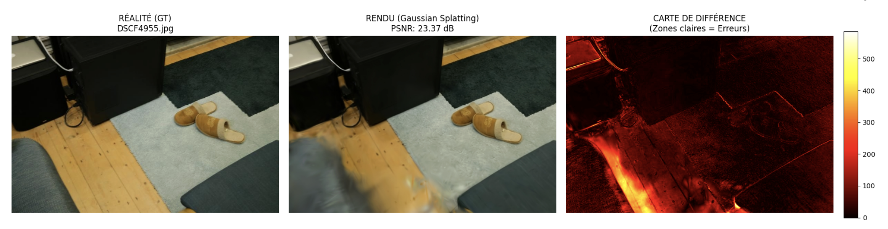
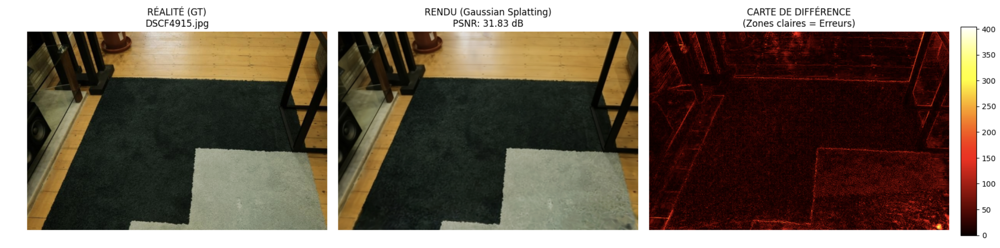

# 3D Gaussian Splatting — scène `room` (Mip-NeRF 360)

Reconstruction 3D par Gaussian Splatting (`splatfacto`, Nerfstudio + gsplat) de la
scène `room` du dataset Mip-NeRF 360, à partir des poses caméra COLMAP fournies.

## Résultats

| Métrique | Valeur |
| --- | --- |
| PSNR moyen (split test) | **31,54 dB** |
| Images de test | 39 |
| Gaussiennes exportées | 394 414 / 400 632 |
| Itérations | 30 000 |
| Matériel | 1× Tesla T4 (~4 h 30) |

Vérité terrain, rendu et carte de différence — les zones claires signalent l'erreur de
reconstruction, principalement sur les arêtes fines et les surfaces spéculaires
(figures produites par `visualize.py`) :




## Installation

```bash
pip install -r requirements.txt
```

`gsplat` compile des extensions CUDA au premier lancement. Les scripts posent
`MAX_JOBS=2` automatiquement : sans cette limite la compilation sature la RAM.

## Données

Le dataset n'est pas inclus dans le dépôt (plusieurs Go). À télécharger séparément :

```bash
wget http://storage.googleapis.com/gresearch/refraw360/360_v2.zip
unzip 360_v2.zip -d data/
```

La scène utilisée est `data/360_v2/room`. Page du projet :
[Mip-NeRF 360](https://jonbarron.info/mipnerf360/).

Deux corrections sont appliquées automatiquement par `train.py`, directement dans le
dossier du dataset :

1. Nerfstudio attend la reconstruction COLMAP dans `colmap/sparse/`, le dataset la
   fournit dans `sparse/`.
2. Les images de `images_4` font 1 px de plus en largeur et en hauteur que ce
   qu'impliquent les intrinsèques COLMAP divisées par 4, ce qui fait échouer le
   dataparser. Elles sont rognées d'un pixel — opération faite une seule fois, un
   fichier marqueur `.images_cropped` empêche de la rejouer.

## Utilisation

Entraînement (correction des données puis `ns-train splatfacto`) :

```bash
python train.py                        # utilise data/360_v2/room
python train.py /autre/chemin/room     # ou un chemin explicite
```

Le nombre d'itérations et le facteur de downscale sont en constantes en haut du script.

Évaluation — exporte le nuage de gaussiennes (`.ply`), rend le split test et calcule
le PSNR. Le script retrouve seul le dernier run entraîné :

```bash
python eval.py
```

Le `.ply` atterrit dans `exports/room/` : c'est le fichier à récupérer pour visualiser
la scène dans un viewer Gaussian Splatting.

Comparaisons visuelles — une figure par image : vérité terrain, rendu, carte de
différence :

```bash
python visualize.py
```

Le sous-ensemble d'images tracé est fixé par le slice `[28:39]` dans le script.
Le rendu utilise `plt.show()` : en dehors d'un notebook, remplacer par
`plt.savefig(f"{name}.png")` pour enregistrer les figures.

## Structure

```
.
├── train.py           # correction des données + entraînement splatfacto
├── eval.py            # export du .ply + PSNR sur le split test
├── visualize.py       # figures GT / rendu / carte de différence
├── requirements.txt
└── assets/            # figures du README
```

Le PSNR est recalculé à la main (`20·log₁₀(255/√MSE)`) plutôt que via `skimage`, dont
la version disponible dans l'image Kaggle posait problème.

Les checkpoints, `.ply` et rendus ne sont pas versionnés (`.gitignore`) : le checkpoint
à 30 000 itérations pèse à lui seul plusieurs centaines de Mo.
